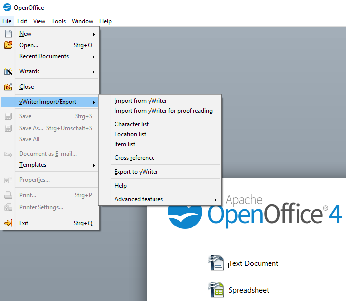

[yWriter](http://spacejock.com/yWriter7.html) is a free word processor written by Australian author and programmer Simon Haynes. yWriter's strengths are structuring novels and controlling the progress during the writing process. With this extension you can combine the advantages of yWriter 7 with the advantages of OpenOffice.

## Features (a Python 3 installation is required)

- Generate a "standard manuscript" formatted **ODF text document (ODT)** from a yWriter 7 project.
- Load yWriter 7 chapters and scenes into an OpenDocument file with chapter and scene markers for **proof reading** and writing back.
- Generate a **brief synopsis** with chapter and scene titles from a yWriter 7 project.
- Generate a **character list** that can be edited in Office Calc and written back to yWriter format.
- Generate a **location list** that can be edited in Office Calc and
 written back to yWriter format.
- Generate an **item list** that can be edited in Office Calc and written back to yWriter format.
- Generate an OpenDocument text file containing navigable **cross references**, such as scenes per character, characters per tag, etc.
- Generate a new yWriter 7 project from a **work in progress** or an **outline** .

You can find more information on the [help pages](help).

## Requirements

- Windows.
- [OpenOffice](https://www.openoffice.org) version 3.0 or more recent.
- [Python 3.6+](https://www.python.org/).
- Java Runtime Environment (OpenOffice might need it for macro execution).

__LibreOffice users:__ _A stand-alone LibreOffice variant not requiring a separate Python installation can be found [here](https://peter88213.github.io/yw-cnv)._

## Download and install

[Download the latest release (version 1.20.0)](https://raw.githubusercontent.com/peter88213/pywoo/main/dist/pywoo-1.20.0.oxt)

- Installation right at download, by double-clicking on the downloaded file, or via the OpenOffice Extension Manager.
- After installation (and Office restart) you find a new "yWriter Import/Export" submenu in the "Files" menu.
- If no additional "yWriter Import/Export" submenu shows up in the "Files" menu, please look at the "Tools" > "Extensions" menu.

[Changelog](changelog)

## Get updates

This extension supports the update mechanism of OpenOffice. You can let the Extension Manager check for updates from time to time to get the latest release.

## Credits

[OpenOffice Extension Compiler](https://wiki.openoffice.org/wiki/Extensions_Packager#Extension_Compiler) by Bernard Marcelly.

Frederik Lundh published the [xml pretty print algorithm](http://effbot.org/zone/element-lib.htm#prettyprint).

## License

This extension is distributed under the [MIT License](http://www.opensource.org/licenses/mit-license.php).

## See also

### The "curly" extensions for OpenOffice and LibreOffice
"Curly quotes" conversion.

### The StyleSwitcher extension for OpenOffice and LibreOffice
A style switcher extension.

### The emph extension for OpenOffice
Use character styles instead of direct formatting to mark up text.

