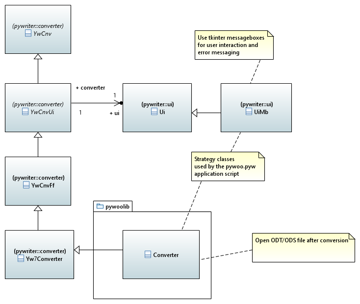
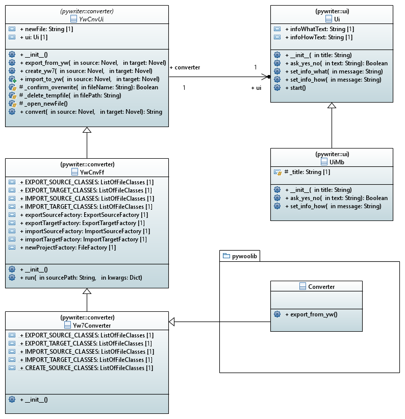

[home](../index) > Project class library overview

---

# Project class library overview

## Modules of the pywoolib package

**converter** -- Provide a converter class for universal import and export. 

## Classes

### Overview

### Detailed class diagram

*Click on the diagram to enlarge*

